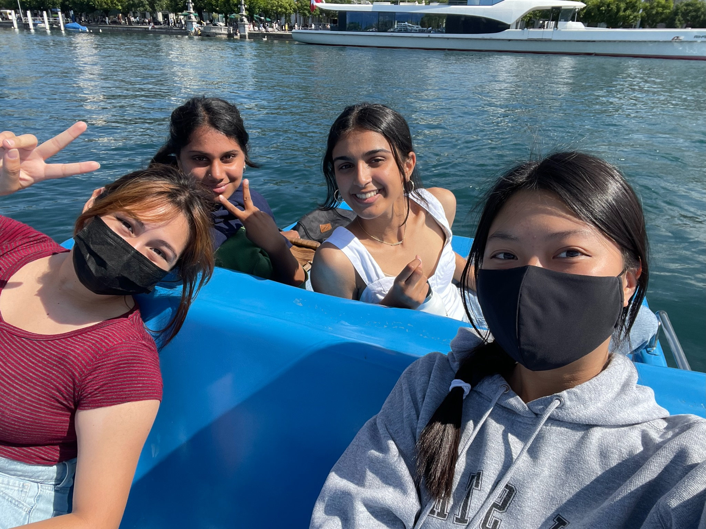
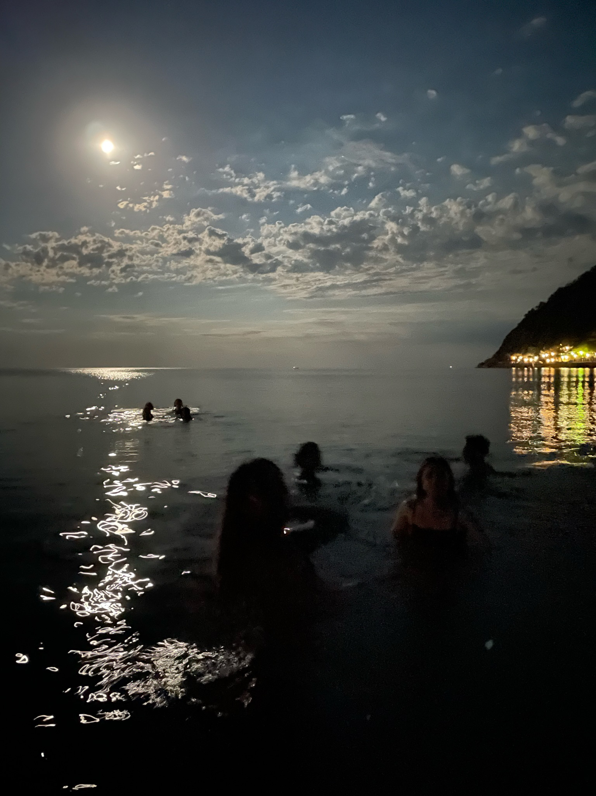

# MY TOP 3 FAVORITE COUNTRIES TO VISIT
I have been to 15 countries throughout my entire life. There have been countries that I have been able to connect with strong 

### **1. SWITZERLAND**

During my time in Switzerland, I went on numerous adventures with my friends. One of my favorite memories in Switzerland was pedal boating in the bay.

Switzerland was one of my favorite places that I visited. I found it so fascinating how the water was absolutely so refreshing and it was so good, Zurich water to be exact. Everything about Switzerland was so refreshing and a clean environment. I wish I could breathe that air FOREVER!

### **2. ITALY**

In Italy, we did a lot of swimming activities where and travelled to different cities. I admired the architecture and the colorful buildings that made the city more lively. One of my favorite activities was midnight swimming. It was so pretty at night, with the moonn at the center

### **3. ENGLAND**

The last time I visited England was in the summer of 2015. I went for 2 months that year, my entire summer break. I got to spend time with my family that lives there, visit Big Ben, and most of all the ICE CREAM. I can't begin to say how delicious and creamy it is. You get the ice cream with a Flake, a chocolate stick that flakes off when you bite into it.

[quiz](nexthttps://www.travelchannel.com/interests/travel-tips/articles/what-bucket-list-trip-should-you-take)
